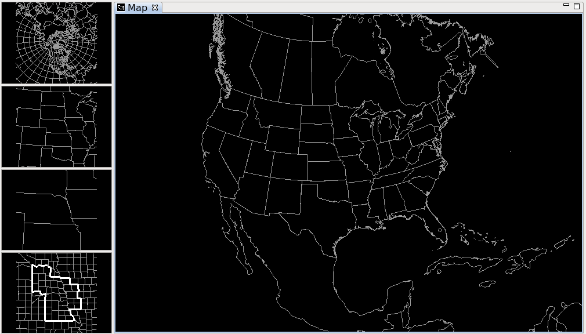
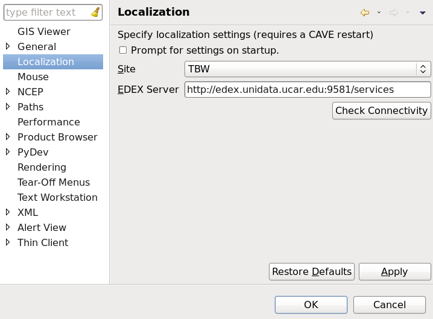
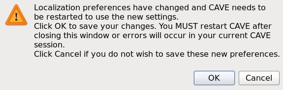
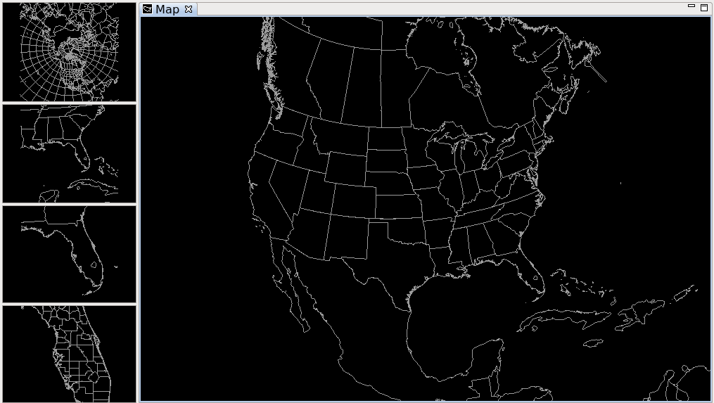

# Five Pane Layout

The default localization site is OAX (a large contingent of Raytheon AWIPS developers work in Omaha and the OAX WFO was the first to integrate and test AWIPS).   Unidata AWIPS 16.1.4 (and later) allow switching the localization site to any NWS WFO ID.  Releases before 16.1.4 are stuck on OAX unless the server administrator manually changes or adds other localization sites (just update to the latest...).

In the menubar, seelct **View > 5 Pane Layout** to make visible a left sidebar containing hemispheric, regional, state, and WFO-level maps.  These maps can be toggled/selected/swapped with a right click. 

# Change Localization Site for CAVE

Under **CAVE > Preferences > Localization** you will see controls both for site and EDEX server name. 

Change the site (example shows TBW Tampa Bay) and click **Okay** or **Apply** and confirm the popup dialog, which informs you that you must *restart* CAVE for the changes to take effect.  

On restart you will see the sidebar maps positioned for your selected site. 

Grid Levels and Parameters
==========================

[Notebook]

List Available Parameters for a Grid Name
-----------------------------------------

    from awips.dataaccess import DataAccessLayer
    
    # Select HRRR
    DataAccessLayer.changeEDEXHost("edex-cloud.unidata.ucar.edu")
    request = DataAccessLayer.newDataRequest()
    request.setDatatype("grid")
    request.setLocationNames("GFS40")
    
    # Print parm list
    available_parms = DataAccessLayer.getAvailableParameters(request)
    available_parms.sort()
    for parm in available_parms:
        print parm

List Available Levels for Parameter
-----------------------------------

    # Set parm to u-wind
    request.setParameters("uW")
    
    # Print level list
    available_levels = DataAccessLayer.getAvailableLevels(request)
    available_levels.sort()
    for level in available_levels:
        print level

Construct Wind Field from U and V Components
--------------------------------------------

    import numpy
    from metpy.units import units
    
    # Set level for u-wind
    request.setLevels("10.0FHAG")
    t = DataAccessLayer.getAvailableTimes(request)
    # Select last time for u-wind
    response = DataAccessLayer.getGridData(request, [t[-1]])
    data_uw = response[-1]
    lons,lats = data_uw.getLatLonCoords()
    
    # Select v-wind
    request.setParameters("vW")
    # Select last time for v-wind
    response = DataAccessLayer.getGridData(request, [t[-1]])
    data_uv = response[-1]
    
    # Print 
    print 'Time :', t[-1]
    print 'Model:', data_uv.getLocationName()
    print 'Unit :', data_uv.getUnit()
    print 'Parms :', data_uw.getParameter(), data_uv.getParameter()
    print data_uv.getRawData().shape
    
    # Calculate total wind speed
    spd = numpy.sqrt( data_uw.getRawData()**2 + data_uv.getRawData()**2 )
    spd = spd * units.knot
    print "windArray =", spd
    
    data = data_uw

  [Notebook]: http://nbviewer.ipython.org/github/Unidata/python-awips/blob/master/examples/notebooks/Grid_Levels_and_Parameters.ipynb
