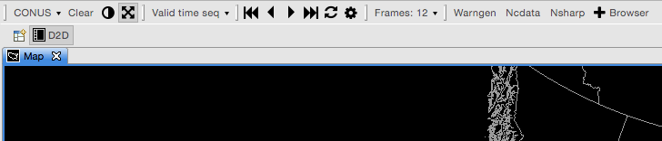
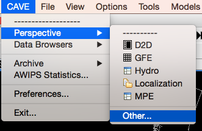
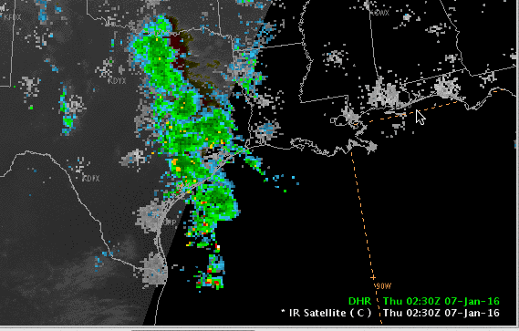
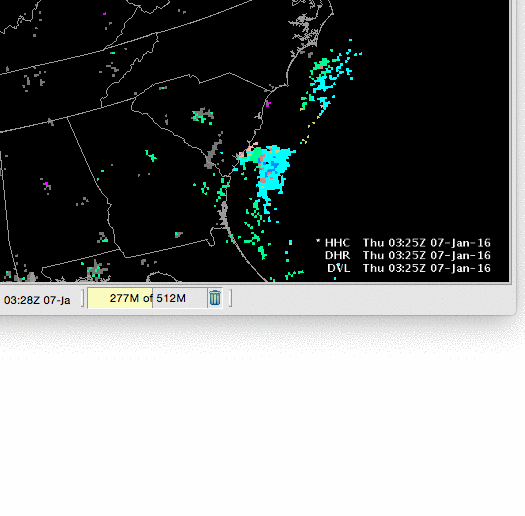
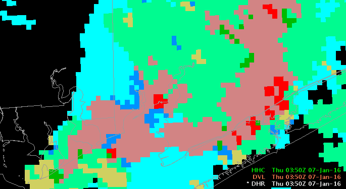
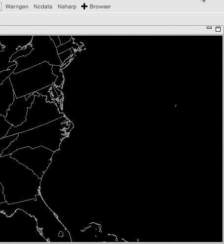

# D2D Toolbar

D2D (Display 2-Dimensions) is the default AWIPS II CAVE perspective, designed to mimmic the look and feel of the legacy AWIPS I system. Frame control, map projection, image properties, and a few featured applications make up the the primary D2D toolbar.  

# Switching Perspectives

D2D is one of many available CAVE perspectives.  By selecting the **CAVE** > **Perspective** menu you can switch into the **GFE**, **Hydro**, **Localization**, **MPE**, or **National Centers Perspective** (which is available in the **Other...** submenu. Nobody seems to know why the NCP is not listed with the other perspectives, or how to make it appear with them).

# Resource Stack

At bottom-right of the map window the the Resource Stack, which displays all loaded resources and map overlays, and allows for interaction and customization with the resource via a **right-click menu**.

## Left-Click Resource Name to Hide

A left click on any resource in the stack will hide the resource and turn the label gray.  Clicking the name again makes the resource visible.

## Hold-Right-Click Resource Name for Menu

Drag the mouse over a loaded resource and **hold** the right mouse button until a menu appears (simply clicking the resource with the right mouse button will toggle its visibility). 

The hold-right-click menu allows you to control individual resource **Image Properties**, **Change Colormaps**, change resource color, width, density, and magnification, **move resources up and down** in the stack, as well as configure custom options with other interactive resources. 

## Hold-Right-Click the Map Background 

for additional options, such as greater control over the resource stack legend, toggling a **4-panel display**, selecting a **Zoom** level, and setting a **Background Color**.  Most loaded resources will also have a menu option for reading out the pixel values:

# Product Browser

The Product Browser allows users to browse a complete data inventory in a side window, organized by data type.  Selections for **GFE**, **Grids**, **Lightning**, **Map Overlays**, **Radar**, **Satellite**, **Redbook**, and **VIIRS** are available.  All products loaded with the Product Browser are given default settings.  

