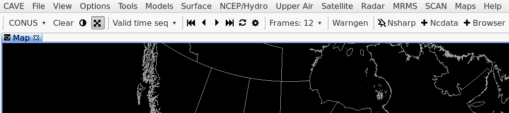
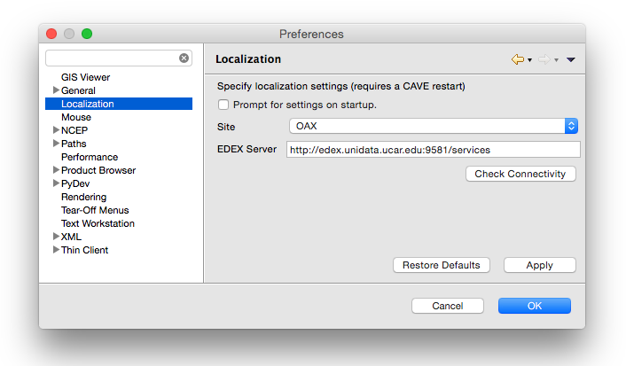
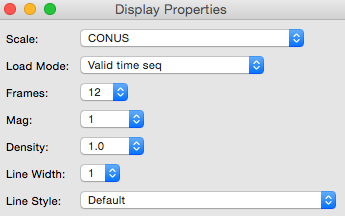

# D2D Toolbar

D2D (Display 2-Dimensions) is the default AWIPS II CAVE perspective, designed to mimmic the look and feel of the legacy AWIPS I system. 

* System menus include **CAVE**, **File**, **View**, **Options**, **Tools**, and **Help** (far right)

* Data menus include **[Models](d2d-grids.html)**, **[Surface](d2d-obs.html)**, **[NCEP/Hydro](d2d-hydro.html)**, **[Upper Air](d2d-uair.html)**, **[Satellite](d2d-satellite.html)**, **[Radar](d2d-radar.html)**, **[MRMS](d2d-mrms.html)**, and **[Maps](d2d-maps.html)**.

Frame control, map projection, image properties, and a few featured applications (**Warngen**, **Nsharp**, **Ncdata**, and **Browser**) make up the the primary D2D toolbar.  

# Preferences

**CAVE > Preferences**

Set the Localization Site and/or derver for the workstation; configure mouse operations, change performance levels, font magnification, and text workstation hostname.

# Switching Perspectives

**CAVE > Perspective**

D2D is one of many available CAVE perspectives.  By selecting the **CAVE** > **Perspective** menu you can switch into the **GFE**, **Hydro**, **Localization**, **MPE**, or **National Centers Perspective** (which is available in the **Other...** submenu. Nobody seems to know why the NCP is not listed with the other perspectives, or how to make it appear with them).

# Resource Stack

At bottom-right of the map window the the Resource Stack, which displays all loaded resources and map overlays, and allows for interaction and customization with the resource via a **right-click menu**.

## Left-Click Resource Name to Hide

A left click on any resource in the stack will hide the resource and turn the label gray.  Clicking the name again makes the resource visible.

## Hold-Right-Click Resource Name for Menu

Drag the mouse over a loaded resource and **hold** the right mouse button until a menu appears (simply clicking the resource with the right mouse button will toggle its visibility). 

The hold-right-click menu allows you to control individual resource **Image Properties**, **Change Colormaps**, change resource color, width, density, and magnification, **move resources up and down** in the stack, as well as configure custom options with other interactive resources. 

## Hold-Right-Click the Map Background 

for additional options, such as greater control over the resource stack legend, toggling a **4-panel display**, selecting a **Zoom** level, and setting a **Background Color**.  Most loaded resources will also have a menu option for reading out the pixel values:

# Product Browser

The Product Browser allows users to browse a complete data inventory in a side window, organized by data type.  Selections for **GFE**, **Grids**, **Lightning**, **Map Overlays**, **Radar**, **Satellite**, **Redbook**, and **VIIRS** are available.  All products loaded with the Product Browser are given default settings.  

# Switch Pane Layouts

will switch between the single page (default) view and the 5-panel WFO view (centered on OAX by default).

# Time Options (Ctrl + T)

This check button enables/disables the ability to select the time interval between frames of real-time or model data. This feature has the added benefit of allowing you to view extended amounts of data (temporally) but stay within the limits of 64 frames. For example, METAR surface plots, which typically display every hour, can be set to display every three hours via the Select Valid Time and Time Resolution Dialog Box.

When the Time Options check button is selected, the next product you choose to display in the Main Display Pane launches either the Select Valid Time and Time Resolution dialog box or the Select
Offset and Tolerance dialog box.

* When you are loading data to an empty display and the Time Options check button is enabled, the Select Valid Time and Time Resolution dialog box opens.

	* **Valid Time:** In this column of dates/times, you may choose the one that will be the first frame loaded onto the Large Display Pane. The Default option is the most recent data.

	* **Time Resolution:** This column contains various time increments in which the data can be displayed. Once you make a selection, the Valid Time Column indents the exact times that will
be displayed. The Default resolution displays the most recent frames available.

* With the Time Options check button enabled for a display that already contains data, when you choose the data to be overlaid in the Main Display Pane, the Select Offset and Tolerance dialog
box appears, providing the following options:

	* **Offset**: This column contains various time increments at intervals before, at, or after the time you selected for the first product that is displayed in the Main Display Pane.

	* **Tolerance**: The options in this column refer to how strict the time matching is. "None" means an exact match, while "Infinite" will put the closest match in each frame, regardless of how
far off it is.

# Data Scale (Ctrl + S)

This check button enables/disables the ability to display data on its native scale. For example, if you enable Data Scaling and select a product from an alternate radar, the data will be displayed with that radar in the center of the screen. Other data can be overlaid on this "dynamic" scale until the Main Display Pane is cleared or a non-plan-view product is loaded.

# Image Combination (Insert)

This check button enables/disables the ability to display two images at once. You can also enable/disable the ability to combine images by using the Toggle Image Combination iconified button on the Toolbar.

Combined-image displays have been improved by removing the valid time for non-forecast products and removing the date string (time is kept) from the left side of the legend. In particular, this
makes All-Tilts radar legends more usable.

# Display Properties

This menu option opens the Display Properties dialog box. All the options available in this dialog box are also available on the Toolbar.

# Loop Properties (Ctrl + L)

Loop Properties is another dialog box that can be opened from the Options menu or from the Loop Properties iconified button on the D2D Toolbar, or by using the Ctrl + L keyboard shortcut. The dialog allows you to adjust the forward and backward speeds, with 0 = off and 10 = maximum speed. You can set the duration of the first and last frame dwell times to between zero and 2.5 seconds.

You can turn looping on or off by checking the Looping check button. There is also a Looping button located on the Toolbar that enables/disables the animation in the large display pane. Finally, you can turn looping on and increase/decrease forward speed by pressing Page Up/Page Down on your keyboard, and turn looping off with the Left or Right Arrow keys. On the toolbar, you can use the button to start/stop looping.

# Image Properties (Ctrl + I)

The Image Properties dialog box can be opened here or by using the Image Properties iconified button on the D2D Toolbar, or using using the Ctrl + I keyboard shortcut. This dialog box provides options that allow you to change the color table; adjust the brightness, contrast, and alpha of either a single image or combined images; fade between combined images; and/or interpolate the displayed data.

# Set Time

This option allows you to set the CAVE clock, located on the bottom of the screen, to an earlier time for reviewing archived data.

# Set Background Color

You can now set the background display color on your workstation. You can also set the background display color for a single pane via mouse Button 3 (B3).
