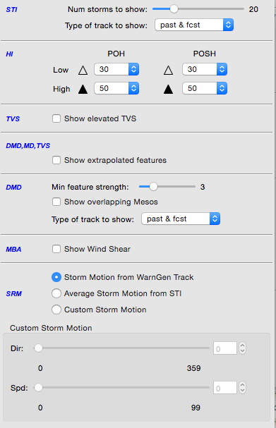

These programs are accessible though the **Tools** dropdown menu, and in individual site radar menus.



# Estimated Actual Velocity (EAV)

A velocity (V) display from the radar shows only the radial component of the wind, so the indicated
speed depends on the direction of the wind and the azimuth (direction) from the radar. Consider, for example, a north wind. Straight north of the radar, the full speed of the wind will be seen on the V product. As one moves around to the east of the radar, the radial component gets smaller, eventually reaching zero straight east of the radar. If the wind direction is known, then the actual wind speed can be computed by dividing the observed radial speed by the cosine of the angle between the radar radial and the actual direction. The EAV tool allows you to provide that angle and use the sampling function of the display to show the actual wind speed.

# 4-D Storm Investigator (FSI)

The [Four-dimensional Stormcell Investigator (FSI)](http://www.nws.noaa.gov/mdl/fsi/) was developed by the National Severe Storms Laboratory for its Warning Decision Support System Integrated Information.  This technology allows users to create and manipulate dynamic cross-sections (both vertical and at constant altitude), such that one can “slice and dice” storms and view these data in three-dimensions and across time.

# V-R Shear

This tool is used in conjunction with Doppler velocity data to calculate the velocity difference (or "shear") of the data directly under the end points. As with the Baselines, this feature comes up editable and the end points can be dragged to specific gates of velocity data. When in place, the speed difference (kts), distance between end points (nautical miles), shear (s-1), and distance from radar (Nmi) are automatically plotted next to the end points and in the upper left corner of the Main Display Pane. A positive shear value indicates cyclonic shear, while a negative value indicates anticyclonic shear. If either end point is not directly over velocity data, the phrase "no data" is reported for the shear value. This tool is also useful in determining gate-to-gate shear. Simply place the two end points directly over adjacent gates of velocity data.

* **"Snapping" VR Shear**: If you are zoomed in over an area when you load VR - Shear, and the VR - Shear Baseline does not appear, click the right mouse button to "snap" the Baseline to where the mouse cursor is located.
* **VR - Shear in 4 Panel**: You can use the VR - Shear Tool when the large display is in 4 panel
mode. The VR - Shear overlay is loaded in different colors for each panel. There are actually
four copies of the program running, and each behaves independently. This means that you can
get accurate readings in any one of the four panels — one VR - Shear panel is editable at a time. To activate, click the center mouse button on the VR - Shear legend in the desired panel and position the query line to the echoes of interest.

# Radar Display Controls

The Radar Display Controls dialog box is derived from the Radar Tools submenu provides options that control the appearance of the Storm Track Information (STI), the Hail Index (HI), the Tornado Vortex Signature (TVS), and the Digital Mesocyclone Display (DMD) products, along with Storm
Relative Motion (SRM) options. The Radar Display Controls dialog box options are described below.

The Radar Display Controls dialog box is divided into six sections: STI, HI, TVS, DMD/MD/TVS, DMD, and SRM. Each section has the following options:

# STI (Storm Track Information)

This section has options to adjust the appearance of the STI graphic product.

* **Number of storms to show**: This slider bar lets you choose the maximum number of storms (0 to 100) you wish to display on the STI product. The default value is 20 storms.

* **Type of track to show**: This options menu allows you to choose the type of storm track that you want displayed.

# HI (Hail Index)

This portion of the Radar Display Controls dialog box contains options that alter the appearance of the HI radar graphic product. You can set the low and high algorithm thresholds of the Probability of Hail (POH) and the Probability of Severe Hail (POSH). Storms that meet the low POH threshold are indicated by small open triangles, while small solid triangles mark those that meet the high POH threshold. Similarly, large open triangles or solid triangles are plotted for the POSH low and high thresholds, respectively.

* **Low hail probability (POH)**: The storms that meet or exceed the threshold are indicated by small open triangles. The default setting is 30.

* **Low severe hail probability (POSH)**: The storms that meet or exceed the threshold are indicated by large open triangles. The default setting is 30.

* **High hail probability**: The storms that meet or exceed the threshold are indicated by small solid triangles. The default setting is 50.

* **High severe hail probability**: The storms that meet or exceed the threshold are indicated by small solid triangles. The default setting is 50.

# TVS (Tornado Vortex Signature)

There is one option in this section of the Radar Display Controls dialog box.

* **Show elevated TVS**: This toggle button lets you control the appearance of the elevated TVS radar graphic product.

# DMD, MD, TVS
There is one option in this section of the Radar Display Controls dialog box.
Show extrapolated Features: With this option, you can choose whether to show the time-extrapolated
features using DMD, MD, or TVS.

