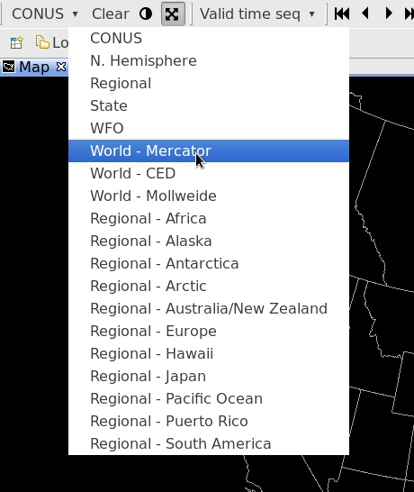
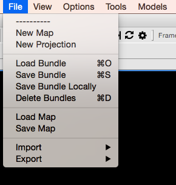
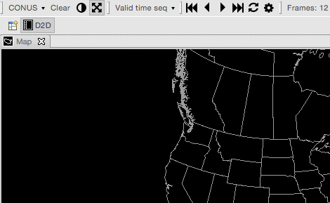
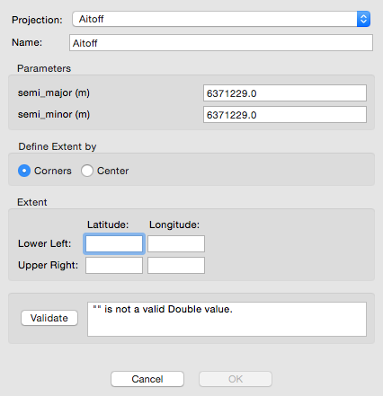
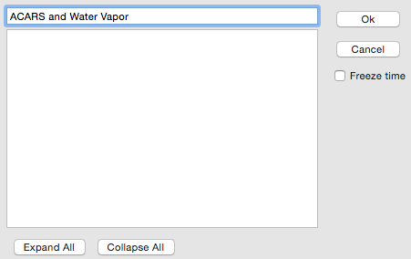
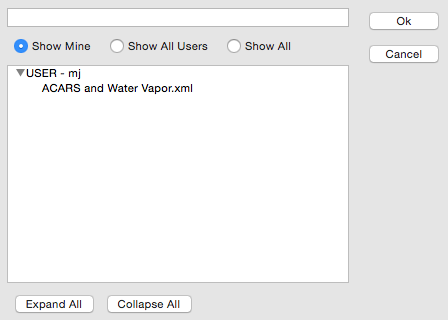
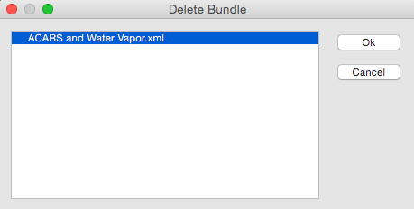
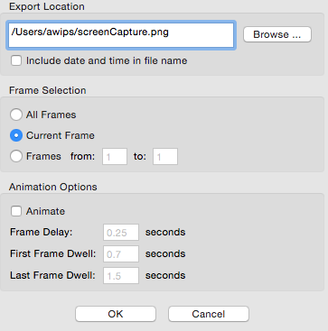
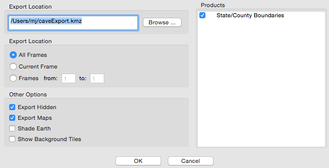

# Maps

The default **CONUS** polar stereographic projection can be changed by selecting the Map Scales menu at top-left (click **CONUS to expand)**...

**File > New Map**

Opens a new map editor tab with the default projection (CONUS Polar Stereographic).  

This can also be done by **right-click** on any tab and selecting **New Editor**

# Projections

**File > New Projection**

Create a new map projection.

# Bundles

**File > Save Bundle**

Save a product display within the AWIPS system, synching the bundle between CAVE and the EDEX server.

**File > Load Bundle**

Load a previously-saved bundle from within the AWIPS system.

**File > Delete Bundle**

Select and remove a saved bundle.

**File > Load Bundle from Disk**

Load a previously-saved display from a path within the file directory of the workstation.

**File > Save Bundle to Disk**

Save a product display to a path within the file directory of the workstation.

**File > Load Map from Disk**

Load a map or product display from a path within the file directory of the workstation.

**File > Save Map to Disk**

Save a map or product display to a path within the file directory of the workstation.

# Import / Export

**File > Import**

Import GIS Data, BCD File, GeoTIFF, LPI File, Shapefile, SPI File, or a D2D Display. The "GIS Data" option opens the GIS application, which provides the ability to import geospatial data from varying GIS data sources. The GIS application has been incorporated into CAVE for use with FX-Net.

**File > Export > Image**

which captures a screenshot of the current view

**File > Export > Print Screen**

will bring up the workstation print dialog.

**File > Export > KML**

The displays can then be used in other applications or sent to other users for analysis. The "Export" submenu also includes a "KML" option, which allows users to save D2D displays in the KML (Keyhole Markup Language) file format (actually as a compressed KMZ), which can be used in applications such as Google Earth.

The KML dialog box includes options to select frames to export, as well as the following "Other Options":

* **Export Hidden**: When selected, all displayed and hidden products listed in the Product Legend section of the Main Display Pane will be exported.

* **Export Maps**: When selected, all enabled maps displayed within the Main Display Pane will be
exported.

* **Shade Earth**: When selected, a shaded background is applied to the exported product. If loaded in Google Earth, the earth will be overlaid with a black backdrop, and data will be displayed as it would in D2D with a black background.

* **Show Background Tiles**: When selected, data (such as plot data) will display on top of black
tiles when loaded in Google Earth.

