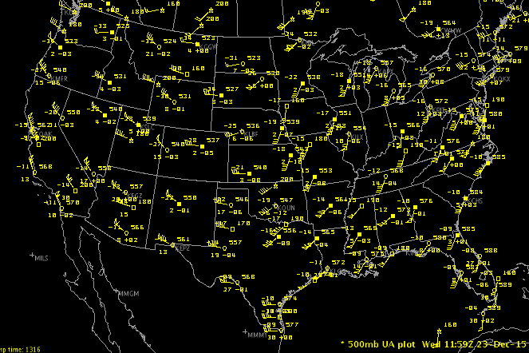
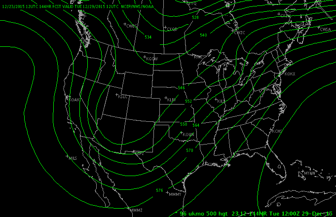
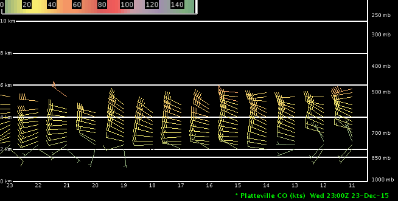
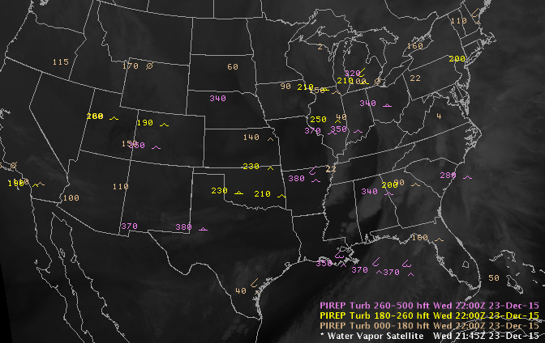
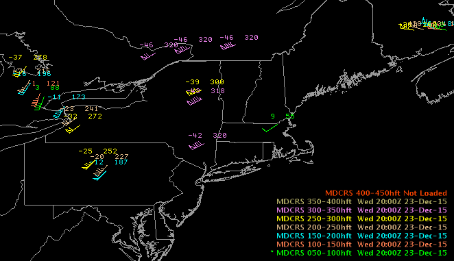
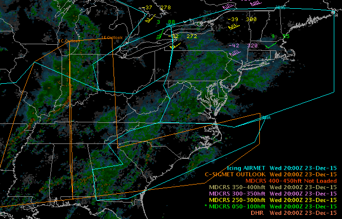
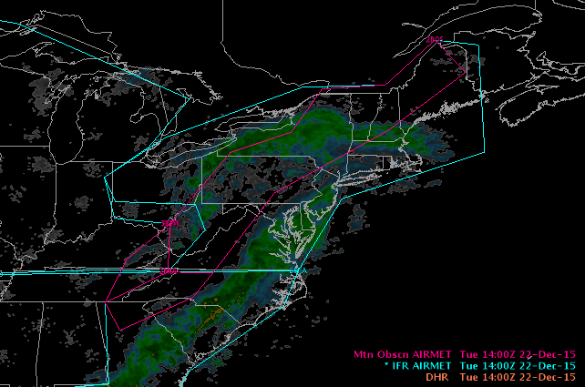
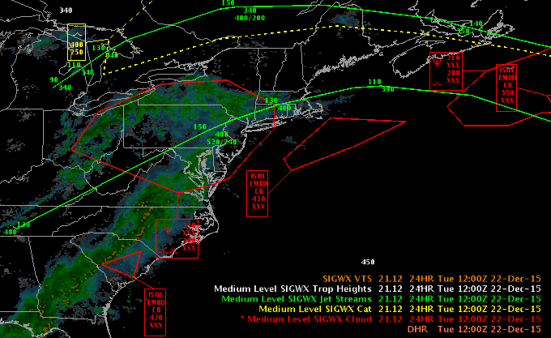



The Upper Air dropdown menu provides access to upper air plots, profiler data, radar plan-view and perspective displays of winds, and aircraft and rawinsonde data. Nearby Radiosonde Observations (RAOB) are also included on the menu to provide easy viewing of upper air data.

## NUCAPS Soundings

The NOAA Unique CrIS/ATMS Processing System ([NUCAPS](http://www.ospo.noaa.gov/Products/atmosphere/soundings/nucaps/)) soundings are derived from processing of CrIS/ATMS data, provides cloud cleared radiances and trace gas that enable increased accuracy in the development of the vertical profile of temperature and water vapor retrievals. By clicking on the individual dots, the forecaster is able to render the sounding for the selected point using the [NSHARP plugin]().

## Upper Air Soundings

## RAOB

RAOB data is plotted on the standard Skew-T log-p thermodynamic diagram. A small reference map indicating the location(s) of the plotted sounding(s) is provided in the upper left corner of the main display pane. If you overlay another Skew-T whose location is far from the original sounding location, the reference map updates to show both locations.

The Interactive NsharpSkewt Program plots and derives quantities on a Skew-T log-p diagram and on a hodograph. You can edit the Skew-T and hodograph data and obtain instantaneous information on the modified data.

Also plotted on the standard Skew-T log-p thermodynamic diagram is the lifted parcel trajectory, displayed on zoom factors greater than 1. For a 12Z sounding, the parcel trajectory is computed based on a surface parcel temperature represented by the forecast maximum temperature for that sounding. At all other observation times, the surface parcel temperature is represented by an average temperature and dewpoint through the lowest 50 mb of the sounding. For the 00Z soundings, the temperature and dewpoint are represented as a low-level (50 mb) mean. For the 12Z soundings, the forecast maximum temperature is used as the "modified" parcel temperature, with the surface dewpoint temperature as the parcel dewpoint. The parameters affected by these modified values are noted with asterisks in the second column of the parameters list on the sounding plot.

The MDPI (Microburst-Day Potential Index) and the WINDEX (Wind Index) determine whether the
environment is favorable for microburst development. The MDPI utilizes vertical profiles of
environmental equivalent potential temperature, while the WINDEX predicts the maximum expected gust possible for a given environmental sounding. For a full description of these equations and the
optimal index values, refer to [http://www.wdtb.noaa.gov/workshop/psdp/Roeder/sec2.htm](http://www.wdtb.noaa.gov/workshop/psdp/Roeder/sec2.htm).

## Upper Air Plots

### NCEP: 200mb to 850mb

### RAOB: 150mb to 925mb

### UKMO 500mb Height

UKMET 500mb height graphic out to 144 forecast hours.

## CPC Charts

* 6-10 day mean 500mb Height
* 8-14 day mean 500mb Height
* 6-10 day 500mb Height Anomaly
* 8-14 day 500mb Height Anomaly

## NPN Profiler Time-Height

NOAA Profiler Network ([NPN](http://www.profiler.noaa.gov/home/)) observations as a time-series plot.  This time-series plugin is also used in the [Volume Browser]() plugin for both grids and observations.

## NPN Profiler Plot

* 200hPa-925hPa
* 1500m-500m AGL
* Surface

## Radar VWP Height-Level

* 15km AGL
* 14km AGL
* 13km AGL
* ...
* 500m AGL
* 250m AGL
* 100m AGL

## Radar VWP Pressure-Level

* 200hPa to 925hPa

### Aircraft PIREP: Low Level, Mid Level, High Level

The Aircraft data includes Low-, Mid-, and High-level Pilot Weather Report (PIREP) observations. The display plots the temperature, aircraft identifier, wind speed and direction, significant weather, and the flight level (in feet). Pilot reports are critical for air safety. Pilots reports on the conditions they are experiencing show up in a matter of minutes on AWIPS. Weather conditions can change quickly, and there is nothing like having a pilot report to provide a bird's eye view of what it is really like up there. PIREPs may validate forecast conditions, or they may describe real-time weather that varies from them.

### Icing: Low Level, Mid Level, High Level

### Tubulence: Low Level Mid Level, High Level

## Aircraft MDCRS

Meteorological Data Collection and Reporting System (MDCRS) data includes plan-view plots for various 5kft layers and ascent/descent soundings. Using the availability plots (Upper Air menu under MDCRS plots) and ACARS Airports from the Maps menu button you can locate airports that have available soundings. ACARS Airports provides an illustration of locations of airports, but it is not necessary to use it. The "+" sign means a temperature sounding and the "\*" means a temperature and dewpoint sounding. To see a sounding at a location, simply press the Points menu button. Several points from letters of the alphabet will appear on the map display. To view a sounding, drag one of the points/letters to a "+" or "\*" location. From the menu bar press Volume and then Browser. From the Volume Browser select MDCRS for Source, Sounding for Fields and select the letter/point on the desired location for Points. Click on your selection in the Product Selection List and then press the Load button to view the sounding.

A zoomable inset map (NW corner) is available to show the location of the sounding. When you zoom in by clicking mouse Button 2 (B2), the flight track of the ascent/descent sounding is shown on the map. In addition, you can sample the flight track to see the time and elevation. To zoom out, click mouse Button 1 (B1). This inset map (and also those on var vs. height displays, cross sections, and cell trends) can be suppressed by setting the global density (i.e., from the tool bar) at less than 1.

* 000-500hft in 50ft increments
* 1 hour profile availability
* 6 hour profile availability

### SIGMET: Convective, Icing, Turbulance,  Tropical, Volcanic

SIGMET (Significant Meteorological Information) is an alphanumeric message describing specific aviation hazard conditions between the surface and 45,000 feet (FL450). A SIGMET includes information about the location of the hazard using VOR locations. SIGMETs are produced on an as-needed basis at the AWC and are distributed on the SBN.

### AIRMET: Icing, Turbulence

AIRMET (Airmen's Meteorological Information) is an alpha-numeric message describing specific aviation hazard conditions between the surface and 45,000 feet (FL450), but not requiring the issuance of a SIGMET. An AIRMET includes information about the location of the hazard using VOR locations. AIRMETs are produced every 6 hours at the AWC for the CONUS area, and are distributed on the SBN.

## Visibility Products

### IFR, Mountain Obscn

## Signiciant Weather

### Medium Level, High Level

