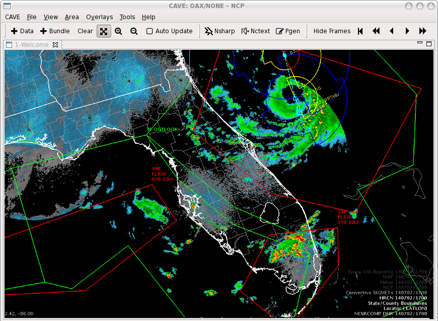
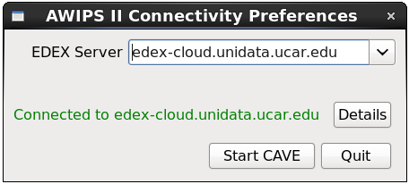

# <core-icon icon="fa:apple" aria-label="file-download" role="img"></core-icon> CAVE for macOS
 
> 10.11 (El Capitan) or lower

[<paper-button raised role="button" tabindex="0"><core-icon icon="file-download" aria-label="file-download" role="img"></core-icon>awips2-cave-16.2.2.dmg</paper-button>](http://www.unidata.ucar.edu/downloads/awips2/awips2-cave-16.2.2.dmg)
 
 * Writes  config files to `~/Library/CAVE`
 * macOS 10.12 (Sierra) not fully supported! Sierra requires cave be run from the command line:

    > New to 10.12 is Gatekeeper Path Randomization, which prevents applications delivered outside of the Mac App Store from running by normal means (taskbar icon or finder). 
    >
    > Until the next release, CAVE on Sierra should be run from the terminal with the command `/Applications/CAVE/cave.app/Contents/MacOS/cave`

 

---

# <core-icon icon="fa:windows" aria-label="file-download" role="img"></core-icon> CAVE for Windows

[<paper-button raised role="button" tabindex="0"><core-icon icon="file-download" aria-label="file-download" role="img"></core-icon>awips-cave.amd64.msi</paper-button>](http://www.unidata.ucar.edu/downloads/awips2/awips-cave.amd64.msi) writes files to `caveData` in the user's home directory. 

[<paper-button raised role="button" tabindex="0"><core-icon icon="file-download" aria-label="file-download" role="img"></core-icon>awips-cave.msi (32-bit)</paper-button>](http://www.unidata.ucar.edu/downloads/awips2/awips-cave.msi)

 

---

# <core-icon icon="fa:linux" aria-label="file-download" role="img"></core-icon> 64-bit Linux (CentOS/RHEL 6 or 7)

[<paper-button raised role="button" tabindex="0"><core-icon icon="file-download" aria-label="file-download" role="img"></core-icon>installCAVE.sh</paper-button>](http://www.unidata.ucar.edu/software/awips2/installCAVE.sh) installs to `/awips2/cave` and writes files to `~/caveData`

    chmod 755 ./installCAVE.sh
    ./installCAVE.sh

## Linux Requirements

* x86_64 CentOS/RHEL 6 or 7
* OpenGL 2.0
* 4GB RAM
* [Latest NVIDIA driver](http://www.nvidia.com/Download/index.aspx?lang=en-us) for your graphics card
* 2GB disk space for caching datasets in `~/caveData`

> All package dependencies should be resolved by yum. 

## How to run CAVE

Find CAVE in the GNOME menu **Applications** &gt; **Internet** &gt; **AWIPS CAVE**

Or from the command line, simply type `cave`

# AWIPS Data in the Cloud

Unidata and Microsoft have partnered to offer a EDEX data server in the Azure cloud, open to the Unidata university community and the public.  Select the server in the Connectivity Preferences dialog, or enter **`edex-cloud.unidata.ucar.edu`** (without adding http:// before, or :9581/services after).

# Troubleshooting

## Localization Preferences Error

You can reset CAVE by removing the `~/caveData` directory (on macOS `~/Library/CAVE`) and then run `cave` again to connect to an EDEX server.  Your local files have been removed, but if you are re-connecting to an EDEX server you have used before, the remote files will sync again to your local `~/caveData` (bundles, colormaps, etc.). 

## No Images Displayed

If you are able to load wire-frame contours but not images, [update your video driver](http://www.nvidia.com/Download/index.aspx?lang=en-us). 
